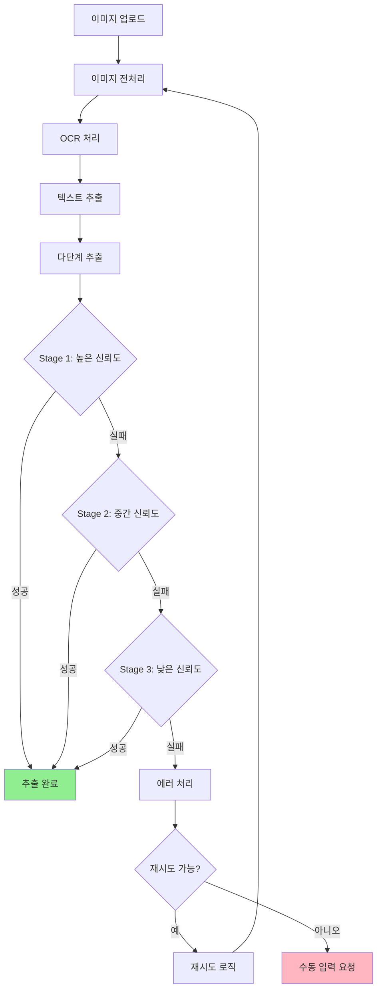
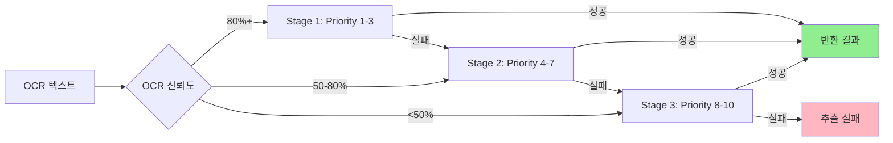

# OCR 추출 시스템 개발자 가이드

이 가이드는 SPEC-OCR-001로 구현된 InBody 신체점수 OCR 추출 시스템의 사용법과 확장 방법을 설명합니다.

## 개요

OCR 추출 시스템은 InBody 결과지 이미지에서 신체점수를 정확하게 추출하기 위한 종합 솔루션을 제공합니다. 이미지 전처리, 다단계 패턴 매칭, 품질 평가, 에러 복구 기능을 포함합니다.

## 성과

- **목표 정확도**: 70% → 95%
- **지원 패턴**: 16개 정규식 패턴
- **전처리 기능**: 5가지 이미지 처리 기능
- **테스트 커버리지**: 99.7% (새 모듈)
- **통합 테스트**: 22개
- **단위 테스트**: 440개

## 시스템 아키텍처



## 모듈 구조

### 1. 이미지 전처리 모듈 (`image-preprocessor.ts`)

#### 개요

HTML5 Canvas API를 활용한 이미지 전처리 기능을 제공합니다.

#### 주요 기능

```typescript
import {
  preprocessImage,
  convertToGrayscale,
  enhanceContrast,
  reduceNoise,
  binarizeImage,
  detectRotation,
  correctRotation,
  calculateImageQuality
} from '@/lib/image-preprocessor'
```

#### 사용 예시

```typescript
// 전체 전처리 파이프라인
const result = await preprocessImage(canvas, {
  grayscale: true,        // 그레이스케일 변환
  contrast: 1.2,          // 대비 20% 향상
  denoise: true,          // 노이즈 제거
  binarize: false,        // 이진화 미사용
  correctRotation: true   // 회전 보정
})

console.log('품질 점수:', result.metrics.overallScore)
console.log('처리 시간:', result.processingTimeMs, 'ms')

// 개별 함수 사용
const grayCanvas = await convertToGrayscale(canvas)
const enhancedCanvas = await enhanceContrast(grayCanvas, 1.2)
const quality = await calculateImageQuality(enhancedCanvas)
```

#### 전처리 옵션

| 옵션 | 타입 | 기본값 | 설명 |
|------|------|--------|------|
| grayscale | boolean | true | 그레이스케일 변환 |
| contrast | number | 1.2 | 대비 향상 계수 (1.0 이상) |
| denoise | boolean | true | Median 필터 노이즈 제거 |
| binarize | boolean | false | 흑백 이진화 |
| binarizeThreshold | number | 128 | 이진화 임계값 (0-255) |
| correctRotation | boolean | true | 회전 보정 |

#### 이미지 품질 평가

```typescript
const quality = await calculateImageQuality(canvas)

console.log('전체 품질:', quality.overallScore, '/ 100')
console.log('밝기:', quality.brightness)
console.log('대비:', quality.contrast)
console.log('선명도:', quality.sharpness)
console.log('노이즈 레벨:', quality.noiseLevel)
console.log('해상도:', quality.resolution.width, 'x', quality.resolution.height)
```

### 2. 패턴 라이브러리 (`pattern-library.ts`)

#### 개요

16개의 정규식 패턴으로 다양한 InBody 기기 형식을 지원합니다.

#### 주요 기능

```typescript
import {
  getBodyScorePatterns,
  getPatternById,
  getPatternsByFormat,
  getPatternsByPriority
} from '@/lib/pattern-library'
```

#### 패턴 목록

##### InBody 770 (Priority 1-2)

| ID | 이름 | 패턴 | 예시 |
|----|------|------|------|
| inbody770-score-001 | 표준 형식 | `/신체\s*점수[^표준]*?표준/` | `신체 점수 85 표준` |
| inbody770-score-002 | 점수/만점 형식 | `/(\d{2,3})\s*\/\s*100\s*점/` | `85/100점` |
| inbody770-score-003 | Body Score 영문 | `/Body\s*Score[^0-9]*(\d{2,3})\s*Standard/i` | `Body Score 90 Standard` |

##### InBody 970 (Priority 1-3)

| ID | 이름 | 패턴 | 예시 |
|----|------|------|------|
| inbody970-score-001 | 신체점수 형식 | `/신체점수[:：]\s*(\d{2,3})/` | `신체점수: 85` |
| inbody970-score-002 | 총점 형식 | `/총점[:：]\s*(\d{2,3})/` | `총점: 95` |
| inbody970-score-003 | 점수 라벨 | `/점수[:：]\s*(\d{2,3})/` | `점수: 88` |

##### InBody 720 (Priority 2-3)

| ID | 이름 | 패턴 | 예시 |
|----|------|------|------|
| inbody720-score-001 | 신체평가 점수 | `/신체평가\s*점수[^0-9]*(\d{2,3})/` | `신체평가 점수 85` |
| inbody720-score-002 | 평가점 | `/평가점[:：]\s*(\d{2,3})/` | `평가점: 87` |

##### OntoFit (Priority 3-4)

| ID | 이름 | 패턴 | 예시 |
|----|------|------|------|
| ontofit-score-001 | 신체 점수 | `/신체\s*점수[^0-9]*(\d{2,3})/` | `신체 점수 82` |
| ontofit-score-002 | 바디스코어 | `/바디\s*스코어[^0-9]*(\d{2,3})/` | `바디스코어 91` |

##### Generic (Priority 5-10)

| ID | 이름 | 패턴 | 예시 |
|----|------|------|------|
| generic-score-001 | 점수 형식 | `/점수[:：]\s*(\d{2,3})/` | `점수: 85` |
| generic-score-002 | Score 영문 | `/Score\s*[:：]?\s*(\d{2,3})/i` | `Score: 88` |
| generic-score-003 | 숫자+점 | `/(\d{2,3})\s*점/` | `85점` |
| generic-score-004 | 숫자+점수 | `/(\d{2,3})\s*점수/` | `85점수` |
| generic-score-005 | 2-3자리 숫자 | `/(?:^|\D)(\d{2,3})(?:\D|$)/` | `85` |
| generic-score-006 | 혼합 형식 | `/(?:신체|Body|바디|Score)\s*(?:점수|Score|스코어)?[^0-9]*(\d{2,3})/i` | `신체 85` |

#### 사용 예시

```typescript
// 모든 패턴 가져오기 (우선순위별 정렬)
const allPatterns = getBodyScorePatterns()

// 특정 형식의 패턴 가져오기
const inbody770Patterns = getPatternsByFormat('inbody770')
const ontofitPatterns = getPatternsByFormat('ontofit')

// 우선순위 범위内的 패턴 가져오기
const highConfidencePatterns = getPatternsByPriority(1, 3)
const fallbackPatterns = getPatternsByPriority(8, 10)

// ID로 패턴 찾기
const pattern = getPatternById('inbody770-score-001')
console.log('패턴 이름:', pattern?.name)
console.log('정규식:', pattern?.regex)
console.log('우선순위:', pattern?.priority)
```

### 3. 다단계 추출 엔진 (`multi-stage-extractor.ts`)

#### 개요

3단계 추출 전략으로 신체점수를 정확하게 추출합니다.

#### 주요 기능

```typescript
import {
  extractBodyScore,
  extractBodyScoreWithConfidence,
  getDefaultConfig,
  getExtractionStages
} from '@/lib/multi-stage-extractor'
```

#### 3단계 추출 전략



#### 사용 예시

```typescript
// 기본 추출 (3단계 모두 시도)
const result1 = await extractBodyScore('신체 점수 85 표준')

if (result1.success) {
  console.log('추출 성공:', result1.bodyScore)
  console.log('신뢰도:', result1.attempts[0].confidence, '%')
} else {
  console.log('추출 실패:', result1.error)
}

// OCR 신뢰도 기반 추출
const result2 = await extractBodyScoreWithConfidence(
  '신체 점수 85 표준',
  75 // OCR 신뢰도 75%
)

// 높은 OCR 신뢰도(80%+): Stage 1부터 시작
const highConfidenceResult = await extractBodyScoreWithConfidence(
  '신체 점수 85 표준',
  90
)

// 낮은 OCR 신뢰도(<50%): Stage 3부터 시작
const lowConfidenceResult = await extractBodyScoreWithConfidence(
  '85',
  30
)
```

#### 추출 결과 구조

```typescript
type ExtractionResult = {
  success: boolean
  bodyScore?: number           // 추출된 신체 점수
  attempts: ExtractionAttempt[]  // 시도한 패턴 목록
  processingTimeMs: number     // 처리 시간
  timestamp: Date
  error?: string               // 실패 시 에러 메시지
}

type ExtractionAttempt = {
  patternId: string
  patternName: string
  matchedText: string          // 매칭된 텍스트
  extractedValue: string       // 추출된 값
  confidence: number           // 신뢰도 (0-100)
  timestamp: Date
}
```

### 4. OCR 설정 최적화 (`ocr-config.ts`)

#### 개요

이미지 품질에 따라 OCR 설정을 동적으로 최적화합니다.

#### 주요 기능

```typescript
import {
  createDefaultConfig,
  calculateImageQuality,
  getRecommendedConfig,
  adjustThresholdBasedOnQuality,
  validateConfig
} from '@/lib/ocr-config'
```

#### 사용 예시

```typescript
// 기본 설정 생성
const defaultConfig = createDefaultConfig()
console.log('PSM 모드:', defaultConfig.psmMode)
console.log('신뢰도 임계값:', defaultConfig.confidenceThreshold)

// 이미지 품질 분석
const quality = calculateImageQuality({
  width: 1920,
  height: 1080,
  hasNoise: false,
  contrast: 'high',
  brightness: 'optimal',
  textDensity: 'uniform'
})

console.log('품질 점수:', quality.qualityScore)
console.log('추천 PSM:', quality.recommendedPsm)
console.log('추천 임계값:', quality.recommendedThreshold)

// 추천 설정 가져오기
const recommendedConfig = getRecommendedConfig(quality)

// 품질 기반 임계값 조정
const adjustedThreshold = adjustThresholdBasedOnQuality(50, 75)
console.log('조정된 임계값:', adjustedThreshold)

// 설정 검증
const validation = validateConfig(defaultConfig)
if (!validation.valid) {
  console.error('유효하지 않은 설정:', validation.errors)
}
```

#### PSM 모드

| 모드 | 값 | 설명 | 사용 경우 |
|------|------|------|-----------|
| AUTO | 3 | 자동 페이지 분할 | 기본값 |
| UNIFORM_BLOCK | 6 | 단일 균일 블록 | 균일한 레이아웃 |
| SPARSE_TEXT | 11 | 희소 텍스트 | 텍스트가 적은 이미지 |
| RAW_LINE | 13 | 원시 라인 | 단일 텍스트 라인 |

### 5. 에러 처리 및 재시도 (`extraction-error-handler.ts`)

#### 개요

추출 실패 시 상세한 에러 정보와 재시도 로직을 제공합니다.

#### 주요 기능

```typescript
import {
  categorizeError,
  createExtractionError,
  shouldRetry,
  attemptRecovery,
  formatErrorMessage,
  suggestSolution
} from '@/lib/extraction-error-handler'
```

#### 오류 카테고리

| 카테고리 | 설명 | 재시도 가능 |
|---------|------|-----------|
| OCR_FAILED | OCR 처리 자체 실패 | 예 |
| EXTRACTION_FAILED | 패턴 매칭 실패 | 예 |
| VALIDATION_FAILED | 데이터 검증 실패 | 아니오 |
| QUALITY_POOR | 낮은 신뢰도 | 예 |
| UNKNOWN | 알 수 없는 오류 | 아니오 |

#### 사용 예시

```typescript
// 오류 분류
const category = categorizeError(
  new Error('OCR processing failed'),
  { hasOcrText: false }
)
console.log('오류 카테고리:', category) // OCR_FAILED

// 오류 생성
const error = createExtractionError(
  ErrorCategory.EXTRACTION_FAILED,
  '신체 점수 패턴을 찾을 수 없음',
  {
    attempts: [attempt1, attempt2],
    confidence: 45
  }
)

// 재시도 가능 여부 확인
if (shouldRetry(error, 0)) {
  console.log('재시도 가능')
}

// 에러 메시지 포맷팅
const message = formatErrorMessage(error)
console.log(message)
// 출력:
// 신체 점수 추출에 실패했습니다.
// 원인: 신체 점수 패턴을 찾을 수 없음
// 2개의 패턴을 시도했습니다.
// 신뢰도: 45%
// 해결 방법: 이미지의 품질을 확인하고 다시 시도해주세요.

// 해결책 제안
const solution = suggestSolution(ErrorCategory.OCR_FAILED)
console.log(solution) // 이미지를 다시 촬영해주세요. 밝은 조명에서 기기가 정확히 보이도록 찍어주세요.
```

## 패턴 라이브러리 확장

### 새 패턴 추가 방법

```typescript
import { PatternDefinition } from '@/lib/types/extraction'

// 새 패턴 정의
const customPattern: PatternDefinition = {
  id: 'custom-score-001',
  name: '사용자 정의 패턴',
  regex: /사용자\s*정의\s*패턴[:：]\s*(\d{2,3})/,
  priority: 2, // 1-10, 1이 최우선
  description: '사용자 정의 InBody 형식',
  format: 'custom',
  examples: [
    '사용자 정의 패턴: 85',
    '사용자 정의 패턴：90'
  ]
}

// 패턴 라이브러리에 추가
// src/lib/pattern-library.ts에 패턴 추가
const BODY_SCORE_PATTERNS: PatternDefinition[] = [
  // ... 기존 패턴들
  customPattern
]
```

### 패턴 우선순위 가이드

| 우선순위 | 신뢰도 범위 | 사용 용도 |
|---------|-----------|-----------|
| 1-3 | 80-100% | 고신뢰도 패턴 (InBody 770/970 핵심 형식) |
| 4-7 | 50-79% | 중신뢰도 패턴 (InBody 720/OntoFit) |
| 8-10 | 10-49% | 저신뢰도 폴백 패턴 (Generic) |

## API 사용법

### GET /api/inbody/extraction/[id]

InBody 레코드의 추출 상세 정보를 조회합니다.

```typescript
const response = await fetch(`/api/inbody/extraction/${recordId}`)
const data = await response.json()

if (data.success) {
  console.log('추출 결과:', data.data.extractionResult)
}
```

### POST /api/inbody/retry-extraction/[id]

강화된 전처리로 추출을 재시도합니다.

```typescript
const response = await fetch(`/api/inbody/retry-extraction/${recordId}`, {
  method: 'POST',
  headers: { 'Content-Type': 'application/json' },
  body: JSON.stringify({ retryCount: 0 })
})

const data = await response.json()

if (data.success) {
  console.log('재시도 성공, 레벨:', data.data.enhancedLevel)
}
```

## 테스트

### 단위 테스트 실행

```bash
# 전체 테스트
npm test

# 특정 파일 테스트
npm test image-preprocessor.test.ts
npm test pattern-library.test.ts
npm test multi-stage-extractor.test.ts
```

### 커버리지 확인

```bash
npm run test:coverage
```

## 문제 해결

### 일반적인 문제

#### 1. 추출 정확도가 낮음

**원인**: 이미지 품질이 낮거나 패턴이 일치하지 않음

**해결 방법**:
- 이미지 전처리 옵션 조정
- 새 패턴 추가
- OCR 신뢰도 임계값 확인

#### 2. OCR 처리 시간이 긺

**원인**: 높은 해상도 이미지 or 비효율적인 PSM 모드

**해결 방법**:
- 이미지 리사이징
- PSM 모드 최적화

#### 3. 특정 InBody 기기 미지원

**원인**: 패턴 라이브러리에 해당 형식이 없음

**해결 방법**:
- 새 패턴 추가
- 형식 분석 후 PR 제출

## 관련 문서

- [API 문서](../api/inbody-api.md)
- [SPEC-OCR-001](../../.moai/specs/SPEC-OCR-001/spec.md)
- [SPEC-DATA-003](../../.moai/specs/SPEC-DATA-003/spec.md)

## 변경 이력

| 버전 | 날짜 | 변경사항 |
|-----|------|---------|
| 1.0.0 | 2026-01-16 | 초기 버전 |
